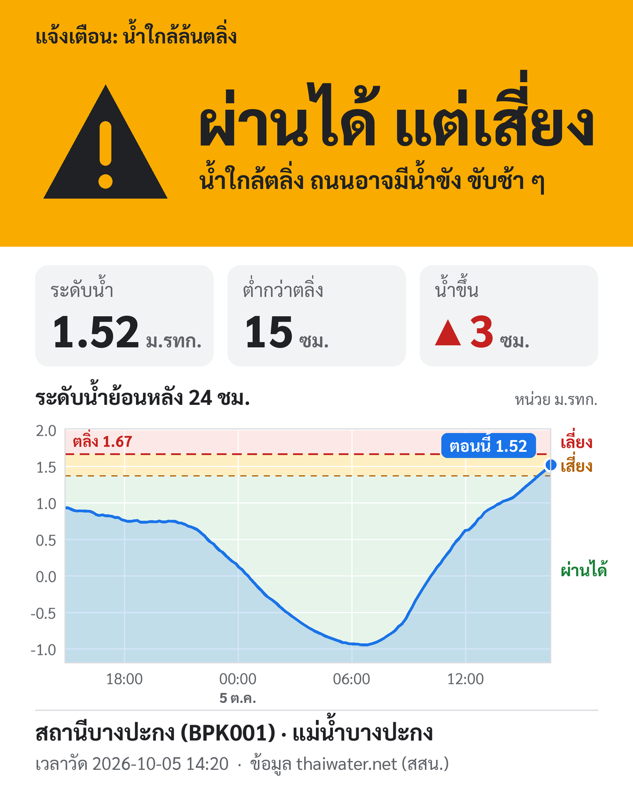

# BPK Water Alert

ระบบแจ้งเตือนระดับน้ำ **4 สถานีใน จ.ฉะเชิงเทรา** (บางปะกง, บางน้ำเปรี้ยว, พนมสารคาม, ปากคลองพระองค์เจ้าฯ) ผ่าน Telegram
ส่งเป็นภาพการ์ดที่มองแวบเดียวรู้ว่าถนนริมน้ำ **ผ่านได้ปกติ / ผ่านได้แต่เสี่ยง / ควรเลี่ยงเส้นทาง** พร้อมกราฟระดับน้ำย้อนหลัง 24 ชม.



ข้อมูลระดับน้ำมาจาก [thaiwater.net](https://www.thaiwater.net/water/wl) ของสถาบันสารสนเทศทรัพยากรน้ำ (สสน.)

---

## ทำอะไรได้บ้าง

- **เช็กทุก 10 นาที** และแจ้งเตือนเมื่อสถานะเปลี่ยนเท่านั้น วันที่น้ำปกติจะไม่มีข้อความเข้ากลุ่มเลย
- **ภาพการ์ดแจ้งเตือน** แบ่งเป็น 3 ส่วน
  - แถบสีบอกสถานะ
  - ตัวเลขระดับน้ำ ระยะห่างตลิ่ง และแนวโน้ม
  - กราฟระดับน้ำที่มีพื้นหลังแบ่งตามโซน
- **รายงานประจำวันเวลา 06:30** ส่งภาพสรุปทุกสถานีทุกเช้าแม้น้ำปกติ ทีมจะได้รู้ด้วยว่าระบบยังทำงานอยู่
- **เรียกดูสถานะเองได้ตลอด** ด้วย `/status` ซึ่งจะส่งภาพสรุปทุกสถานี (เรียงสถานีที่อันตรายที่สุดไว้บนสุด) พร้อมปุ่มชื่อสถานีให้กดดูการ์ดและกราฟรายสถานี
- **แจ้งเตือนแยกรายสถานี** สถานีไหนเปลี่ยนสถานะก็แจ้งเฉพาะสถานีนั้น
- ถ้าสร้างภาพไม่สำเร็จจะส่งเป็นข้อความแทน แจ้งเตือนจึงไม่หาย
- รันบน Docker ได้ทันที ตัว container รันด้วย user ธรรมดา (ไม่ใช่ root) และไม่เปิดพอร์ตใด ๆ

### เกณฑ์สถานะ

| สถานะ | เงื่อนไข (ค่าเริ่มต้น) | ข้อความบนภาพ |
| --- | --- | --- |
| 🟢 ปกติ | ห่างตลิ่ง ≥ 30 ซม. | ผ่านได้ปกติ |
| 🟠 เสี่ยง | ห่างตลิ่ง < 30 ซม. | ผ่านได้ แต่เสี่ยง |
| 🔴 ล้นตลิ่ง | ระดับน้ำ ≥ ตลิ่ง | เลี่ยงเส้นทาง |
| ⚪ ข้อมูลค้าง | สถานีไม่ส่งค่าใหม่เกิน 2 ชม. | ข้อมูลไม่อัปเดต |

สถานีที่ตั้ง `ROAD_LEVEL_<รหัส>` ไว้ จะใช้ **ระดับถนน** แทนตลิ่งในทุกเงื่อนไขข้างบน (ข้อความเปลี่ยนเป็น "น้ำใกล้ขึ้นถนน" / "น้ำท่วมถนน") เพราะถนนบางจุด เช่น จุดกลับรถใต้สะพานบางปะกง ต่ำกว่าตลิ่งหรือมีน้ำย้อนท่อ จึงท่วมก่อนน้ำล้นตลิ่ง

### จังหวะการแจ้งเตือน

| เหตุการณ์ | แจ้ง? |
| --- | --- |
| สถานะเปลี่ยน (ปกติ → เสี่ยง → ล้นตลิ่ง และขากลับ) | ✅ |
| อยู่ในโซนเสี่ยงหรือล้นตลิ่ง แล้วน้ำขึ้นอีก 10 ซม. | ✅ แจ้งซ้ำ |
| สถานะเหมือนเดิม | ❌ |
| ทุกวันเวลา 06:30 | ✅ รายงานประจำวัน (ถ้ารอบนั้นมีแจ้งเตือนอยู่แล้ว จะไม่ส่งซ้อน) |
| กลับเป็นปกติ | ✅ เมื่อห่างตลิ่ง ≥ 35 ซม. (เผื่อระยะ 5 ซม. ไม่ให้แจ้งสลับไปมา) |

---

## เริ่มใช้งานเร็ว

### 1. เตรียม Telegram

1. สร้างบอทกับ [@BotFather](https://t.me/BotFather) แล้วเก็บ **token** ไว้
2. เพิ่มบอทเข้ากลุ่ม แล้วพิมพ์ `/start@<ชื่อบอท>` ในกลุ่ม
3. เปิด `https://api.telegram.org/bot<TOKEN>/getUpdates` แล้วดู **Chat ID** จาก `"chat":{"id": ...}`

### 2. ตั้งค่า

```bash
cp .env.example .env        # Windows: copy .env.example .env
```

ใส่ `TELEGRAM_BOT_TOKEN` และ `TELEGRAM_CHAT_ID` ในไฟล์ `.env`

### 3a. รันด้วย Docker (แนะนำ)

```bash
mkdir -p data
docker compose up -d --build
docker compose run --rm bpk-alert python bpk_bank_alert.py --test   # ส่งภาพทดสอบเข้ากลุ่ม
```

ขั้นตอนนำขึ้น Linux server แบบละเอียด รวมถึงการตั้งสิทธิ์ไฟล์และวิธีแก้ปัญหา อยู่ใน **[DEPLOY.md](DEPLOY.md)**

### 3b. รันด้วย Python โดยตรง

ต้องใช้ Python 3.9 ขึ้นไป

```bash
pip install requests pillow
python bpk_bank_alert.py --test
```

ถ้าไม่ใช้ Docker ต้องตั้ง Task Scheduler หรือ cron ให้รัน `python bpk_bank_alert.py` ทุก 10 นาทีเอง และถ้าต้องการปุ่มกับคำสั่ง `/status` ต้องรัน `python bpk_bank_alert.py --bot` ค้างไว้อีกตัว

> ⚠️ เครื่องที่รันต้อง**ออกอินเทอร์เน็ตด้วย IP ในประเทศไทย** เพราะ thaiwater.net ไม่ตอบ IP ต่างประเทศ (ทดสอบแล้ว: cloud ที่สิงคโปร์เชื่อมต่อไม่ได้)

---

## คำสั่ง

| คำสั่ง | ทำอะไร |
| --- | --- |
| `python bpk_bank_alert.py` | เช็ก 1 รอบ และแจ้งเตือนถ้าสถานะเปลี่ยน |
| `python bpk_bank_alert.py --test` | ส่งภาพทดสอบพร้อมค่าปัจจุบันเข้ากลุ่ม |
| `python bpk_bank_alert.py --preview` | สร้างภาพตัวอย่างครบ 4 สถานะในโฟลเดอร์ `preview/` (ไม่ส่ง Telegram) |
| `python bpk_bank_alert.py --bot` | รันบอทรอรับ `/status` และปุ่ม 🔄 (รันค้างไว้ตลอด) |

ใน Docker ให้เติม `docker compose run --rm bpk-alert` ไว้ข้างหน้า

### คำสั่งบน Telegram

| คำสั่ง | ทำอะไร |
| --- | --- |
| `/status` | ภาพสรุปทุกสถานี + ปุ่มเลือกสถานี |
| `/status บางน้ำเปรี้ยว` หรือ `/status BPK003` | การ์ดและกราฟเฉพาะสถานี (พิมพ์ชื่อบางส่วนก็ได้) |
| ปุ่ม 🔄 สถานีนี้ล่าสุด / 📋 ทุกสถานี | อยู่ใต้ภาพแจ้งเตือนทุกภาพ |
| `/help` | วิธีใช้ |

บอทตอบเฉพาะแชตที่อยู่ใน `TELEGRAM_CHAT_ID`

---

## ตั้งค่า (`.env`)

| ค่า | ค่าเริ่มต้น | ความหมาย |
| --- | --- | --- |
| `TELEGRAM_BOT_TOKEN` | – | Token บอทจาก @BotFather |
| `TELEGRAM_CHAT_ID` | – | Chat ID ของกลุ่ม ถ้ามีหลายกลุ่มให้คั่นด้วย `,` |
| `STATION_CODES` | `BPK001,BPK003,BPK004,BKK016` | รหัสสถานีที่เฝ้าระวัง คั่นด้วย `,` |
| `AREA_TITLE` | (ว่าง) | หัวข้อภาพสรุป (ว่าง = "ระดับน้ำ จ.<จังหวัด>") |
| `NEAR_M` | `0.30` | ห่างตลิ่งน้อยกว่านี้ (เมตร) ถือว่าเสี่ยง |
| `HYSTERESIS_M` | `0.05` | ต้องลดลงอีกเท่านี้จึงนับว่ากลับปกติ |
| `REPEAT_STEP_M` | `0.10` | ระหว่างอยู่ในสถานะเตือน ถ้าน้ำขึ้นอีกเท่านี้จะแจ้งซ้ำ |
| `STALE_H` | `2` | สถานีไม่ส่งค่าใหม่เกินกี่ชั่วโมงจึงแจ้งว่าข้อมูลไม่อัปเดต |
| `ALERT_IMAGE` | `1` | `1` = ส่งเป็นภาพ, `0` = ส่งข้อความอย่างเดียว |
| `GRAPH_HOURS` | `24` | กราฟย้อนหลังกี่ชั่วโมง |
| `ROAD_NAME_<รหัส>` | (ว่าง) | ชื่อจุดหรือถนนที่ต้องระวังของสถานีนั้น เช่น `ROAD_NAME_BPK003=...` (ค่า `ROAD_NAME` แบบเดิมยังใช้ได้ จะผูกกับ BPK001) |
| `ROAD_LEVEL_<รหัส>` | (ว่าง) | ระดับน้ำที่สถานี (ม.รทก.) ที่ถนนจุดนั้นเริ่มมีน้ำ จดจากหน้างานจริง ตั้งแล้วจะเตือนเทียบกับถนนแทนตลิ่ง เช่น `ROAD_LEVEL_BPK001=1.15` |
| `DAILY_REPORT_TIME` | `06:30` | ส่งรายงานสถานะทุกวันเวลานี้ แม้น้ำปกติ (เว้นว่าง = ปิด) |
| `STATE_FILE` | `bpk_alert_state.json` | ไฟล์เก็บสถานะ (ใน Docker ตั้งเป็น `data/...` ไว้แล้ว) |

ความถี่ในการเช็กตั้งที่ `INTERVAL_SEC` ใน [docker-compose.yml](docker-compose.yml) ค่าเริ่มต้นคือ 600 วินาที

---

## โครงสร้างโปรเจกต์

```text
.
├── bpk_bank_alert.py     # สคริปต์หลัก: ดึงข้อมูล, ตัดสินสถานะ, ส่ง Telegram, โหมดบอท
├── alert_card.py         # วาดภาพการ์ด + กราฟ (Pillow)
├── fonts/                # ฟอนต์ Sarabun (SIL OFL 1.1)
├── docs/                 # รูปประกอบ README
├── Dockerfile
├── docker-compose.yml    # 2 services: bpk-alert (ตัวเช็ก) + bpk-bot (ตัวรับคำสั่ง)
├── .env.example          # ตัวอย่างค่าตั้งค่า → คัดลอกเป็น .env
├── DEPLOY.md             # คู่มือ deploy บน Linux server
└── data/                 # (สร้างตอนรัน) ไฟล์สถานะ ไม่ขึ้น Git
```

## ทำงานอย่างไร

```text
ทุก 10 นาที
  thaiwater waterlevel_load ──► หาสถานี BPK001 ──► คำนวณระยะห่างตลิ่ง ──► จัดสถานะ (มี hysteresis)
                                                                              │
                         เทียบกับสถานะเดิมใน data/bpk_alert_state.json ◄──────┘
                                       │ เปลี่ยน?
                                       ▼
          thaiwater waterlevel_graph (24 ชม.) ──► วาดภาพการ์ด ──► Telegram sendPhoto (+ ปุ่ม 🔄)

ตัวบอท (รันตลอด)
  Telegram getUpdates (long polling) ──► /status หรือกดปุ่ม ──► ดึงข้อมูลล่าสุด ──► ส่งภาพกลับ
```

API ที่ใช้ (public ไม่ต้องใช้ key):

- `https://api-v3.thaiwater.net/api/v1/thaiwater30/public/waterlevel_load`: ค่าล่าสุดของทุกสถานี
- `https://api-v3.thaiwater.net/api/v1/thaiwater30/public/waterlevel_graph`: ค่าย้อนหลังรายสถานี ทุก 10 นาที

---

## หมายเหตุ

- ไฟล์ `.env` มี Bot token จึงอยู่ใน `.gitignore` และ `.dockerignore` แล้ว ห้ามนำขึ้น Git หรือ file share ถ้าสงสัยว่า token หลุด ให้ใช้คำสั่ง `/revoke` กับ @BotFather
- สถานะถนนตีความจากระดับน้ำที่สถานี ไม่ได้มาจากเซนเซอร์บนถนน ถ้ารู้ระดับที่ถนนจุดนั้นเริ่มมีน้ำจริง ให้ตั้ง `ROAD_LEVEL_<รหัส>` (วิธีเทียบ: ตอนเห็นน้ำเริ่มขึ้นถนน จดเวลา แล้วดูค่าระดับน้ำของสถานีช่วงเวลานั้น)
- ข้อมูลเป็นของ สสน. ระบบนี้ใช้เพื่อการเฝ้าระวังภายใน ไม่ใช่ประกาศทางการ
- ฟอนต์ Sarabun ใช้สัญญาอนุญาต [SIL Open Font License 1.1](fonts/OFL.txt)
